  

  
  &nbsp;·&nbsp;
  <a href="https://www.linkedin.com/in/saifuddin-adenwala-916b35249/">LinkedIn</a>
  &nbsp;·&nbsp;
  <a href="mailto:adenwala32@gmail.com">Email</a>
  &nbsp;·&nbsp;
  <a href="https://github.com/Saifuddin53?tab=repositories">Repositories</a>

## Engineering snapshot

| | |
|---|---|
| **Mobile** | Kotlin · Jetpack Compose · Swift · SwiftUI · Flutter · Kotlin Multiplatform · watchOS |
| **Realtime & IoT** | BLE/GATT · ESP32 · WebRTC/RTC · live audio/video · Firebase |
| **Backend** | Node.js · TypeScript · Parse Server · MongoDB · Valkey/Redis |
| **Cloud & delivery** | React · Docker · DigitalOcean · Cloudflare · CI/CD · app-store delivery |

  

## Open source

30+ merged upstream pull requests across Kotlin modernization, Jetpack Compose, mobile architecture, persistence, navigation, concurrency, and testing.

  <a href="https://github.com/search?q=is%3Apr+author%3ASaifuddin53+is%3Amerged&type=pullrequests">View merged pull requests</a>
  &nbsp;·&nbsp;
  <a href="https://github.com/Saifuddin53?tab=repositories">Explore public repositories</a>

