  

  <a href="https://www.linkedin.com/in/saifuddin-adenwala-916b35249/">LinkedIn</a>
  &nbsp;·&nbsp;
  <a href="https://www.upwork.com/freelancers/~01185b7fd7b43fdd84">Upwork</a>
  &nbsp;·&nbsp;
  <a href="mailto:adenwala32@gmail.com">Email</a>
  &nbsp;·&nbsp;
  <a href="https://github.com/Saifuddin53?tab=repositories">Repositories</a>

## I turn product ideas into production systems

I am a **mobile product engineer and full-stack application developer** focused on products that need more than screens and APIs. I work across native Android and iOS, cross-platform mobile, backend architecture, cloud infrastructure, deployment, and store operations—taking ownership from the first technical decision through production growth.

My strongest work lives where mobile meets complex systems: **real-time communication, connected devices, high-traffic architecture, payments and engagement mechanics, media, and reliable release operations**.

> **Production proof:** 50K+ installs · 4.4★ store rating · 30+ merged upstream pull requests · end-to-end Android, iOS, backend, cloud, and release ownership

## What I build

| Mobile products | Real-time systems |
| --- | --- |
| Native Android and iOS, Flutter, Kotlin Multiplatform, polished UI systems, offline-first data, notifications, subscriptions, and store delivery. | Live audio/video, chat, presence, co-hosting, media pipelines, event-driven flows, and architectures designed for traffic spikes. |

| Connected applications | Product infrastructure |
| --- | --- |
| BLE/GATT integrations, device discovery and reconnection, sensor ingestion, health-device workflows, ESP32 communication, and local history. | Node.js services, Parse Server, MongoDB, Valkey, Firebase, object storage/CDN, Docker, CI/CD, observability, and production operations. |

## Engineering range

| Layer | Technologies and capabilities |
| --- | --- |
| **Mobile** | Kotlin · Jetpack Compose · Android SDK · Swift · SwiftUI · Dart · Flutter · Kotlin Multiplatform · Compose Multiplatform |
| **Connected devices** | Bluetooth Low Energy · GATT · ESP32 · sensor data · device provisioning · reconnection strategies · offline synchronization |
| **Backend and data** | Node.js · TypeScript · JavaScript · Express · Parse Server · MongoDB · Firebase · Valkey/Redis · REST APIs · webhooks |
| **Real-time and media** | WebRTC/RTC SDKs · live audio/video · chat and presence · push notifications · media processing · object storage and CDN delivery |
| **Web and operations** | React · TypeScript · Vite · Docker · DigitalOcean · Cloudflare · CI/CD · logging · monitoring · app-store and release operations |

## How I work

- **Own the complete lifecycle:** architecture, implementation, testing, deployment, monitoring, releases, and iteration.
- **Design for production reality:** unreliable networks, concurrency, high traffic, failure recovery, security boundaries, and operational visibility.
- **Connect every layer:** mobile clients, backend contracts, data models, real-time infrastructure, cloud services, and release pipelines.
- **Think like a product owner:** balance engineering quality with user experience, delivery speed, growth, and maintainability.

## Engineering in the open

Most of my production systems are private, so my public GitHub is a focused view of how I engineer. It includes **30+ merged upstream pull requests** across established Android and open-source codebases, covering Java-to-Kotlin modernization, Jetpack Compose, dependency injection, persistence, navigation, concurrency, bug fixing, and testability.

  

## Good problems to bring me

- A greenfield mobile product that needs one engineer to connect the entire system.
- An existing Android, iOS, or Flutter application that needs architecture, performance, or release help.
- A BLE/IoT product that needs reliable mobile-to-device communication.
- A real-time or media-heavy platform that must stay responsive as usage grows.
- A mobile product that also needs its backend, cloud deployment, admin tooling, and production operations handled.

  <strong>Building something ambitious?</strong> 
  <a href="mailto:adenwala32@gmail.com">Start a conversation</a> · <a href="https://www.upwork.com/freelancers/~01185b7fd7b43fdd84">Work with me on Upwork</a>

