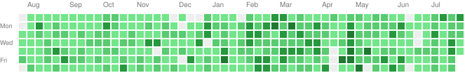

  

  I build complete digital products across mobile, connected devices, backend systems and cloud infrastructure — from the first idea to launch and scale.

  
  &nbsp;·&nbsp;
  <a href="https://www.linkedin.com/in/saifuddin-adenwala-916b35249/">LinkedIn</a>
  &nbsp;·&nbsp;
  <a href="mailto:adenwala32@gmail.com">Email</a>
  &nbsp;·&nbsp;
  <a href="https://github.com/Saifuddin53?tab=repositories">Repositories</a>

## What I build

| Mobile products | Connected experiences |
|---|---|
| Native Android, iOS and watchOS applications, plus shared applications built with Flutter and Kotlin Multiplatform. | Products that communicate with IoT devices, Bluetooth hardware and realtime audio or video systems. |

| Complete product development | Launch and scale |
|---|---|
| Product design, frontend, backend, databases, APIs and the architecture connecting everything together. | Cloud deployment, app-store delivery, monitoring, performance improvements and infrastructure prepared for growth. |

## Core technologies

### Mobile

  

Kotlin · Jetpack Compose · Swift · SwiftUI · watchOS · Flutter · Dart · Kotlin Multiplatform

### Connected systems

  

BLE/GATT · ESP32 · IoT devices · WebRTC/RTC · realtime audio and video · Firebase

### Backend and data

  

Node.js · TypeScript · Parse Server · MongoDB · Valkey/Redis · APIs

### Frontend, cloud and delivery

  

React · Docker · DigitalOcean · Cloudflare · GitHub Actions · CI/CD · App Store and Play Store delivery

## Consistency

  

  

## Open source

**37 publicly visible changes accepted and merged into open-source projects.**

These contributions cover mobile architecture, interface development, navigation, data storage, concurrency, testing and modernization of existing applications.

  <a href="https://github.com/search?q=is%3Apr+author%3ASaifuddin53+is%3Amerged&type=pullrequests">View merged pull requests</a>
  &nbsp;·&nbsp;
  <a href="https://github.com/Saifuddin53?tab=repositories">Explore public repositories</a>

<!--
Visuals generated with open-source projects:
- capsule-render: https://github.com/kyechan99/capsule-render
- githubchart-api: https://github.com/2016rshah/githubchart-api
- github-readme-streak-stats: https://github.com/DenverCoder1/github-readme-streak-stats
- skill-icons: https://github.com/tandpfun/skill-icons
-->
